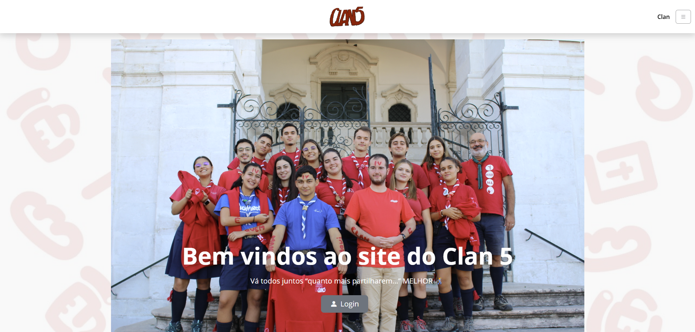
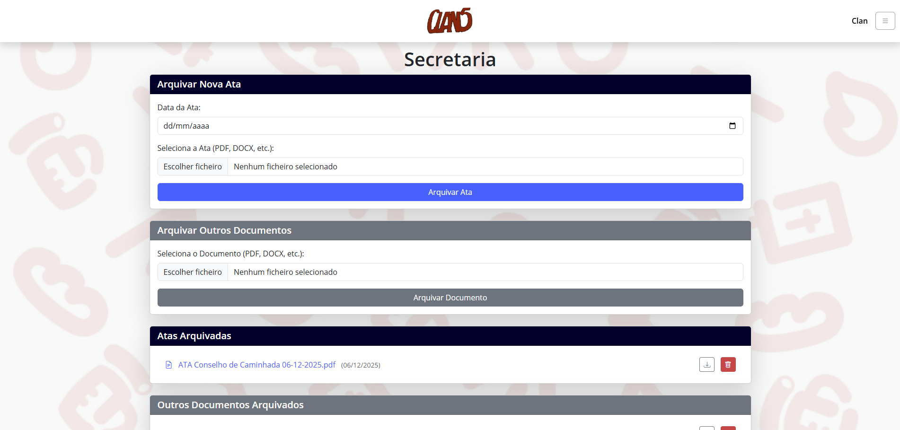
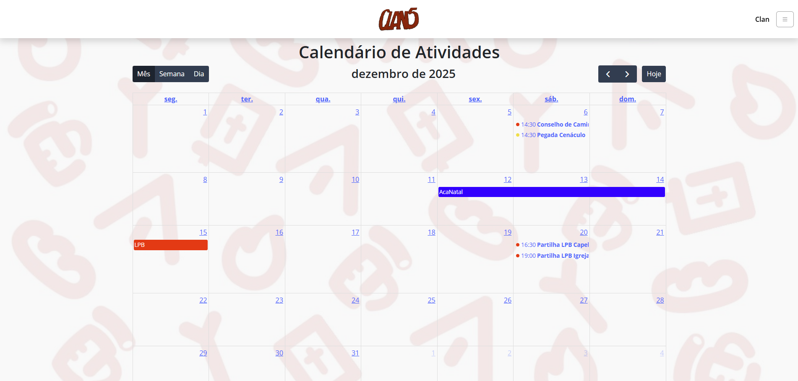
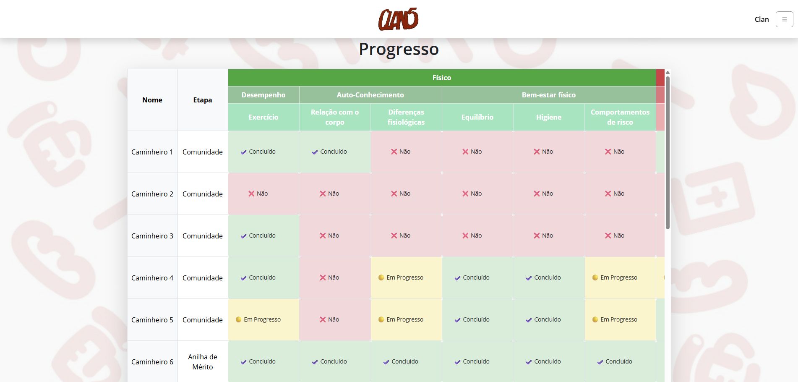
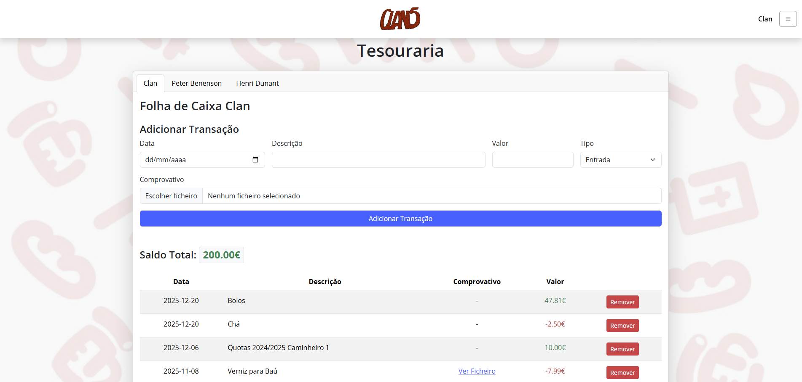
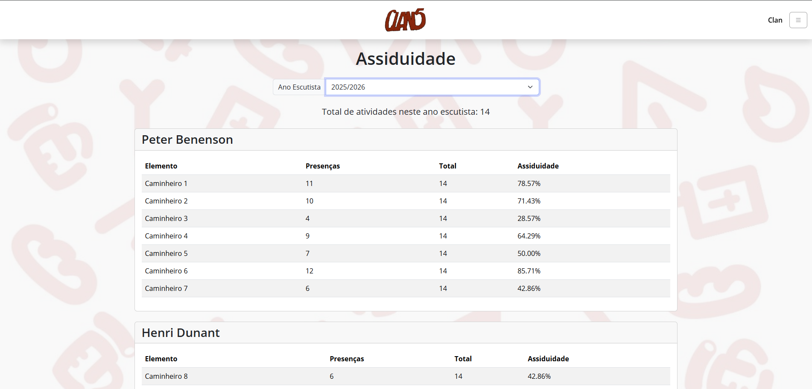

# ⚜️ Plataforma de Gestão - Clã 5 (CNE)

[PT] Uma solução centralizada para a gestão de reuniões, atividades e cargos do Clã 5 do Agrupamento 42 Penha de França do CNE.
[EN] A centralized management platform for scouts' meetings, activities, and roles.

> **Nota:** Esta plataforma é de uso interno. Para fins de demonstração, o deploy pode ser consultado em: [clan5.onrender.com](https://clan5.onrender.com/) 🚀

---

## 📝 Sobre o Projeto
Este projeto nasceu da necessidade de modernizar a gestão do Clã, evoluindo de um simples gestor de presenças para uma plataforma integrada que serve todas as frentes da Unidade. O objetivo é facilitar a vida aos caminheiros e dirigentes, centralizando dados de progresso, tesouraria e logística num único local acessível.

## 🛠 Funcionalidades Principais
A plataforma está dividida por áreas de necessidade e cargos:

* **📊 Assiduidade:** Calculador automático e registo de presenças em atividades.
* **📅 Planeamento:** Calendário de atividades e arquivo de registos passados.
* **⛺ Gestão de Tribos:** Organizador de elementos e cargos de cada tribo.
* **💼 Áreas Específicas:** Páginas dedicadas para Secretaria, Tesouraria, Material, Farmácia e Cozinha.
* **📈 Progresso Individual:** Visualização e atualização da caminhada de cada escuteiro.
* **💰 Contas Individuais:** Gestão de saldos e movimentos financeiros.
* **🔐 Sistema de Acesso:** Diferentes níveis de permissão para garantir a segurança dos dados.

## ⚙️ Tecnologias e Arquitetura
O projeto utiliza uma arquitetura moderna para garantir disponibilidade online:

* **Backend:** Python com a framework **Flask**.
* **Frontend:** HTML, CSS e integração dinâmica de dados.
* **Base de Dados:**
    * **Supabase:** Armazenamento de dados críticos e relacionais.
    * **JSON:** Utilizado para dados de alta mutabilidade (inventários, composição de tribos).
    * **CSV:** Para arquivos estáticos e históricos de atividades.
* **Deployment:** Alojado no **Render**.

## 🔐 Acesso e Segurança
Para manter a integridade dos dados, o sistema possui regras de edição:

1. **Acesso Público:** Consulta geral e adição de novos registos.
2. **Utilizador "Clan":** Gestão de tribos e permissão para apagar ficheiros/registos.
3. **Utilizador "Chefe":** Permissões totais, incluindo gestão de contas individuais, sistema de progresso e criação de novos utilizadores.

## 📂 Estrutura do Projeto

```text
SITE_CLAN5/
├── app.py                # Servidor Flask e lógica principal
├── .env                  # Variáveis de ambiente (Privado)
├── requirements.txt      # Dependências do projeto
├── registros/            # Base de dados histórica em CSV (Assiduidade)
├── static/               # Assets: Imagens (.png, .jpg) e Logos
├── templates/            # Páginas HTML (Jinja2)
│   └── partials/         # Componentes reutilizáveis (ex: folha_caixa)
├── tesouraria/           # Ficheiros JSON de contas individuais
├── uploads/              # Documentos, atas, receitas e manuais (PDF/Docx)
├── instance/             # Bases de dados SQLite locais (.db)
├── debug/                # Scripts auxiliares de migração e verificação
└── *.json                # Configurações de progresso, tribos e inventários
```
## 📸 Demonstração do Sistema

| **Home** | **Secretaria** | **Calendário** |
| :---: | :---: | :---: |
|  |  |  |
| **Sistema de Progresso** | **Tesouraria** | **Assiduidade** |
|  |  |  |

> **Nota:** As capturas de ecrã acima utilizam dados fictícios ou ocultos para garantir a privacidade dos membros do Clã.
---
<p align="center">
  <b>Servir!</b> ⚜️🔴
</p>
